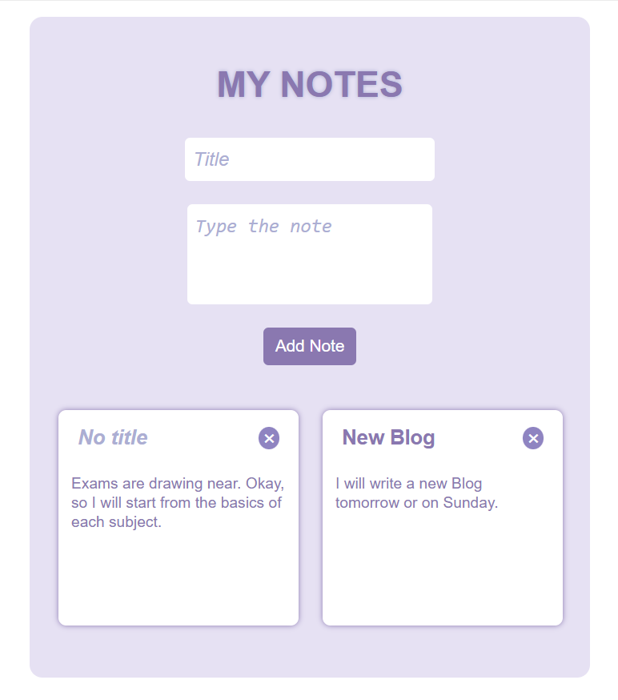

# 📝 Notes App (React)

A clean and minimal Notes application built with **React** that allows users to create, view, delete, and persist notes using **localStorage**.

This project was built to strengthen my understanding of React fundamentals such as state management, controlled components, props, and side effects.

---

## ✨ Features

- ➕ Add notes with title and content  
- 🗑️ Delete notes  
- 💾 Persistent storage using `localStorage`  
- 🧠 Default title handling (`No title` when empty)  
- 📐 Uniform note card layout with scrollable content  
- 🎨 Clean and minimal UI  

---

## 🛠️ Tech Stack

- **React**
- **JavaScript (ES6+)**
- **CSS**
- **Vite**

---

## 📸 Screenshots

